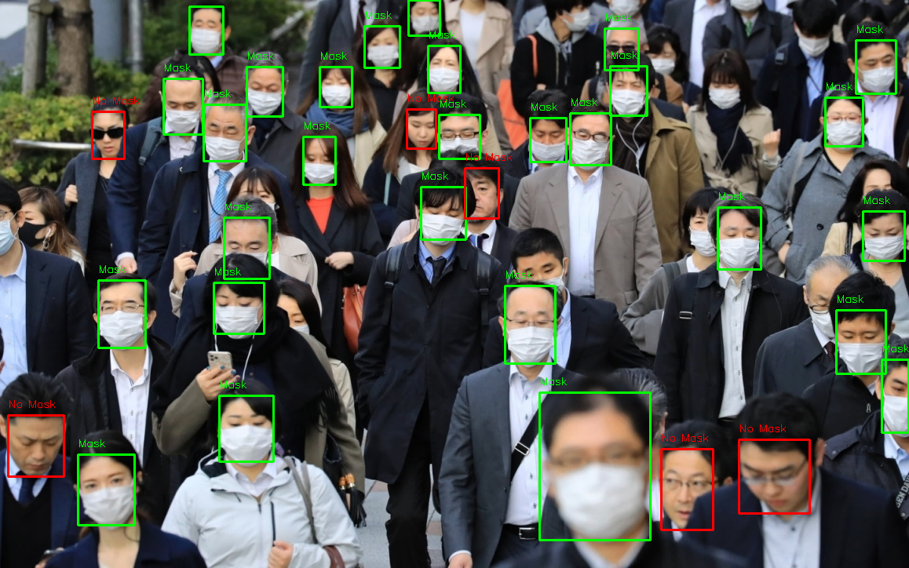
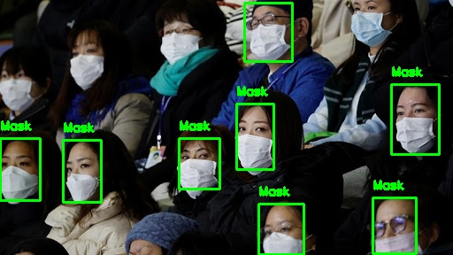
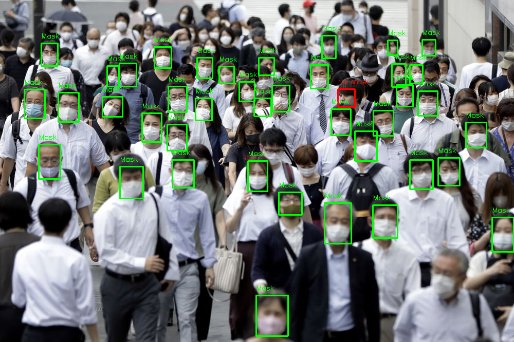
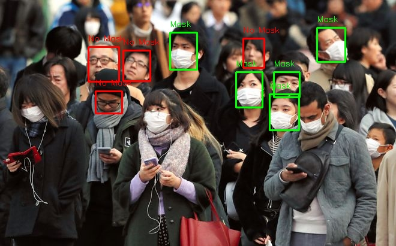
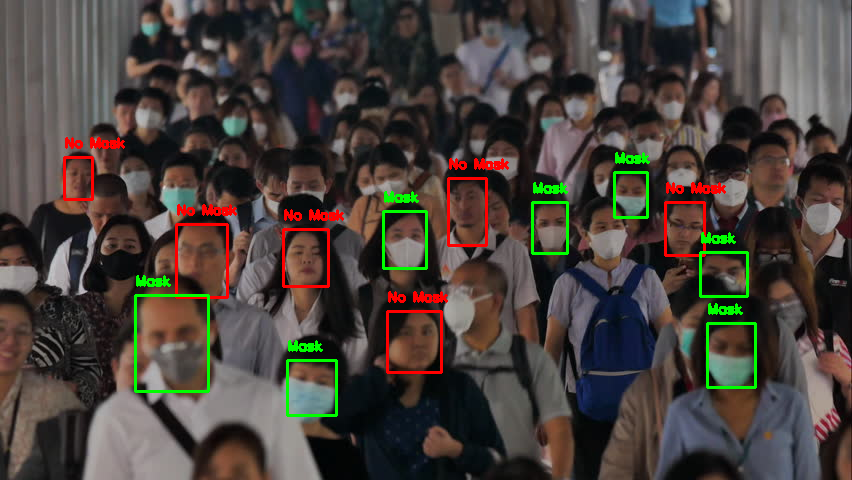
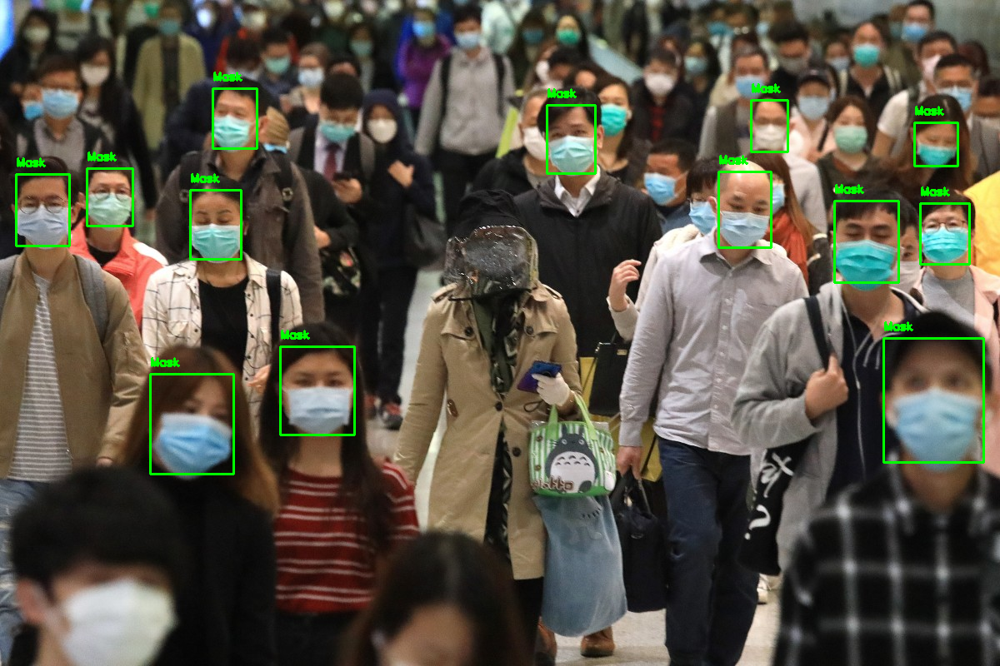
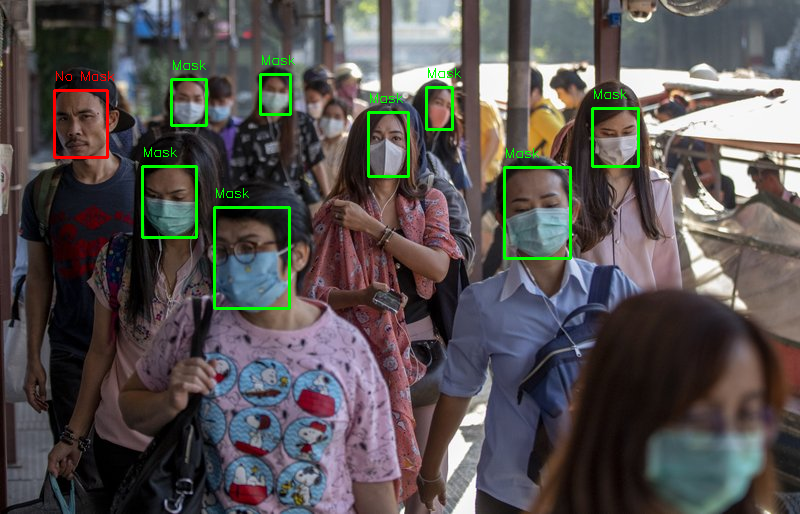
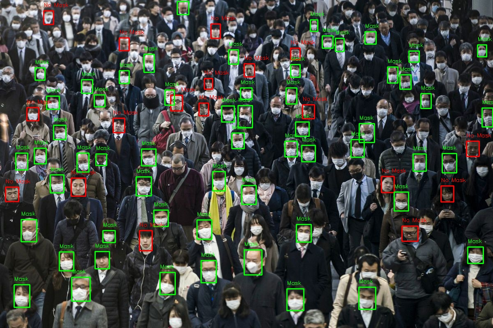
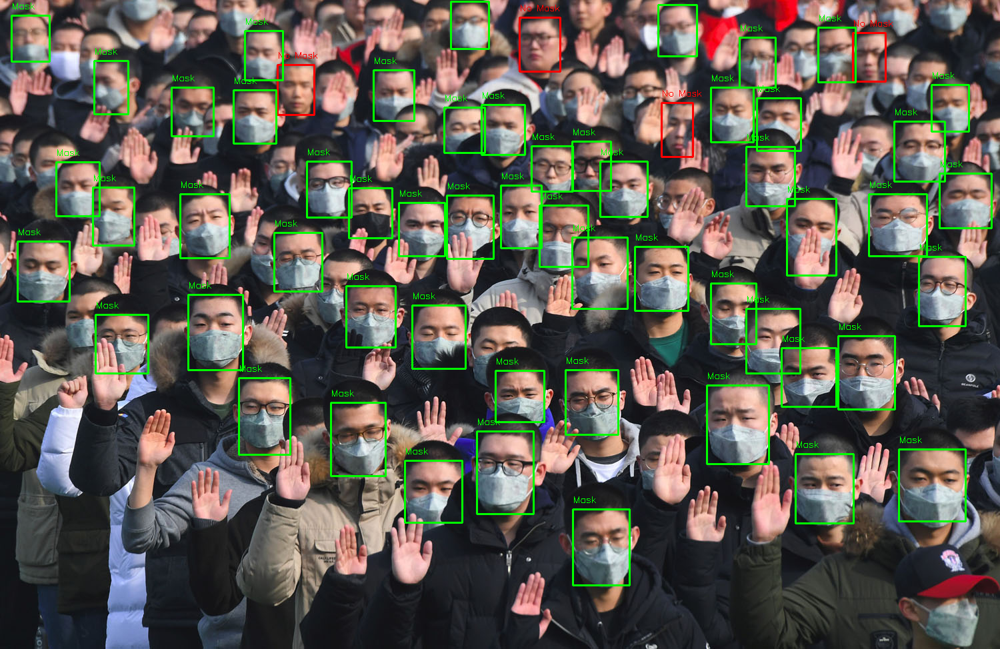

# Face Mask Detection


Detecting face mask with OpenCV and TensorFlow. Using simple CNN or model provided by TensorFlow as MobileNetV2, VGG16, Xception.



## Data

Raw data collected from kaggle and script crawl_image.py, split to 'Mask' and 'Non Mask' class.

Using build_data.py to extract faces from raw dataset and resize to 64x64.

## Installation

Clone the repo

```
git clone git@github.com:ksvbka/face-mask-detector.git
```
cd to project folder and create virtual env

```
virtualenv .env
source .env/bin/activate
pip install -r requirements.txt
```

Download raw dataset and execute script build_dataset.py to preprare dataset for training
```
cd data
bash download_data.sh
cd -
python3 build_dataset.py --data-dir data/64x64_dataset --output-dir data/dataset_raw/
```
## Training

Execute train.py script and pass  network architecture type dataset dir and epochs to it.
Default network type is MobileNetV2.
```
python3 train.py --net-type MobileNetV2 --data-dir data/64x64_dataset --epochs 20
```
View tensorboard
```
tensorboard --logdir logs --bind_all
```
## Testing

```
python3 mask_detect_image.py -i demo_image/2.jpg
```

## Result
Hyperparameter: 
    - batch size: 32
    - Learing rate: 0.0001
    - Input size: 64x64x3

Model result
| Model         | Test Accuracy| Size        | Params    | Memory consumption|
| ------------- | -------------|-------------|-----------|-------------------|
| CNN           |  87.67%      | 27.1MB      | 2,203,557 | 72.58 MB
| VGG16         |  93.08%      | 62.4MB      | **288,357**    | **18.06 MB**
| MobileNetV2 (fine tune)  |  97.33%      | **20.8MB**  | 1,094,373 | 226.67 MB
| **Xception**  | **98.33%**   | 96.6MB      | 1,074,789 | 368.18 MB

Download pre-trained model: [link](https://drive.google.com/u/0/uc?id=1fvoIX1cz3O8yF3VNfneoM0AK7bR5ok7T&export=download)

## Demo

Using MobileNetV2 model











